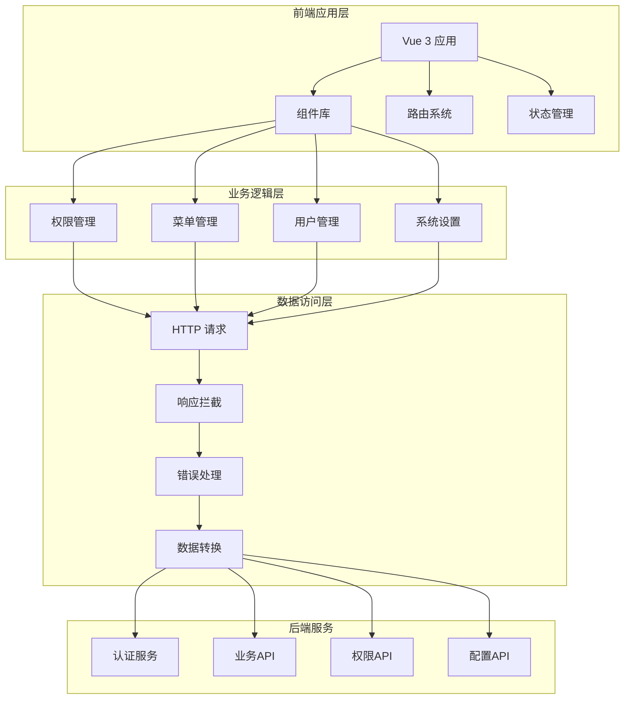
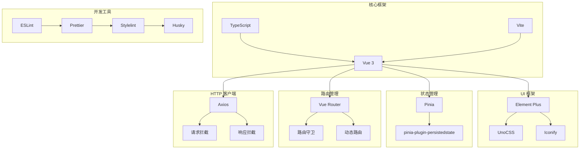
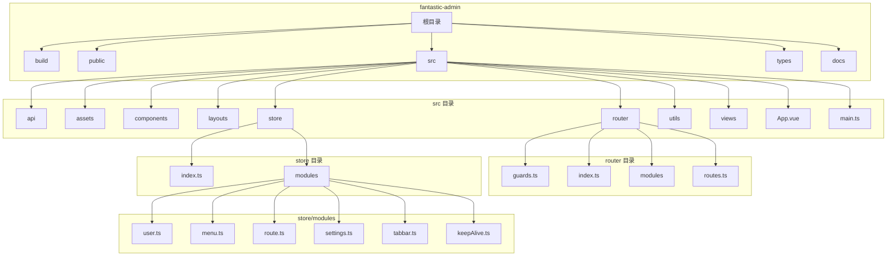
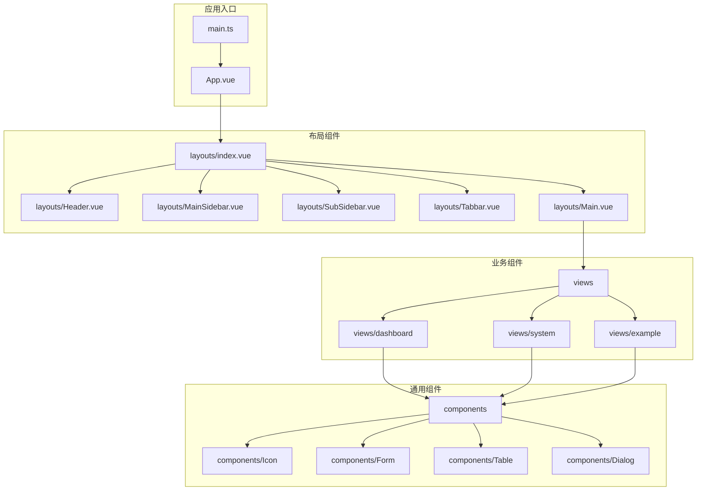
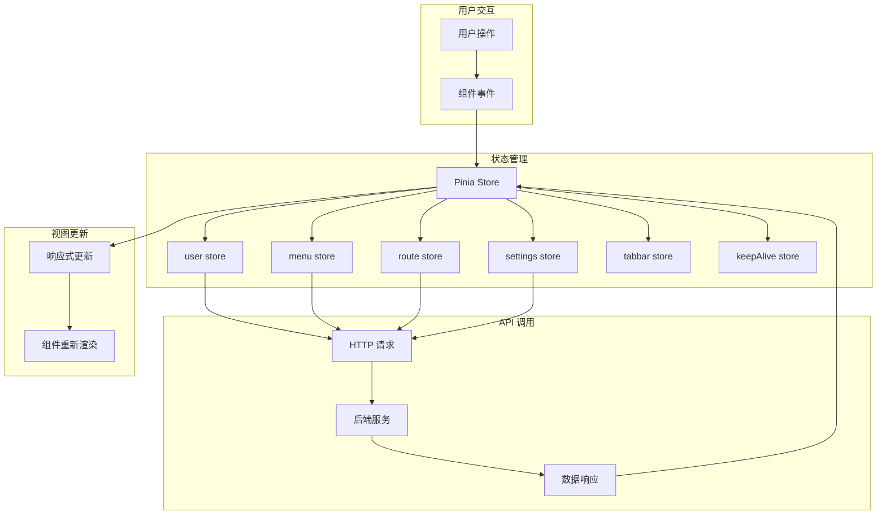
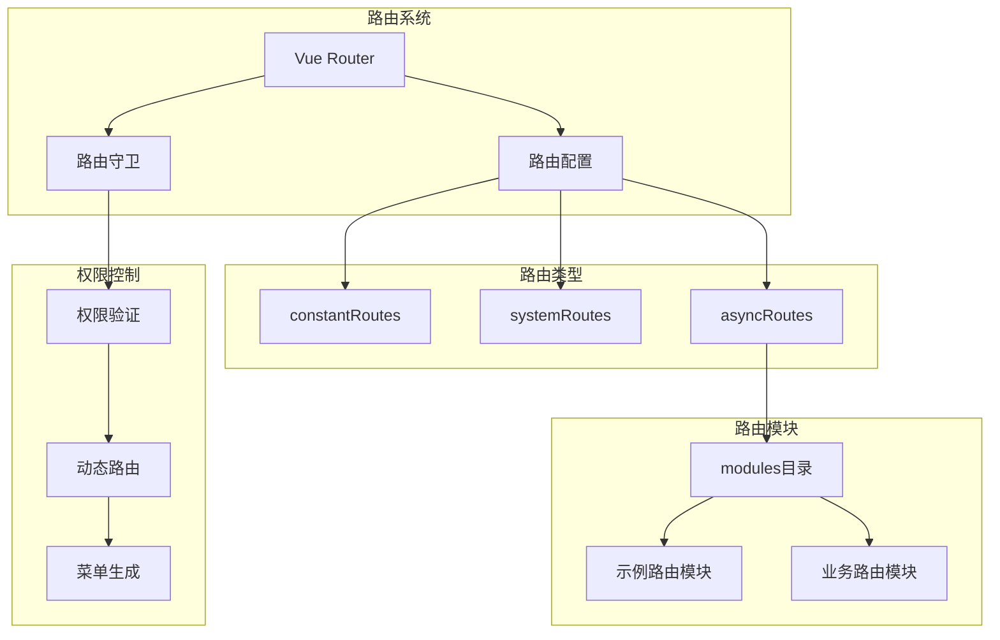
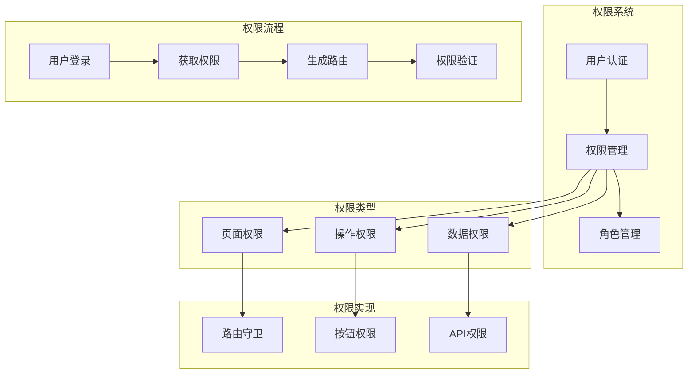
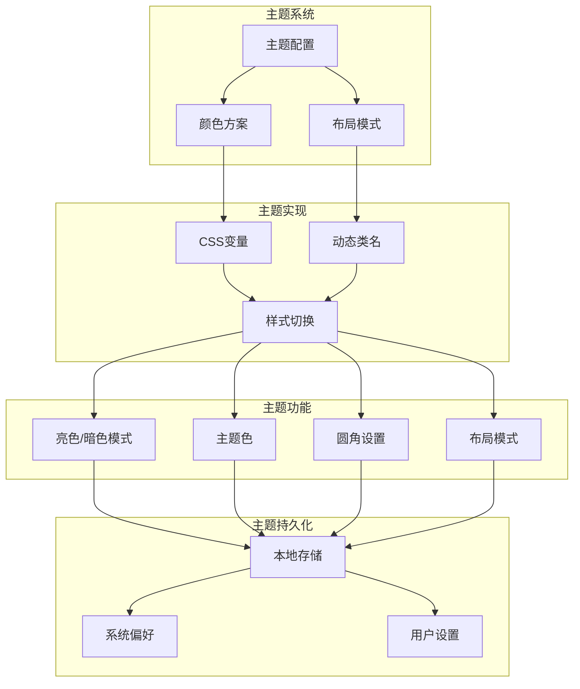
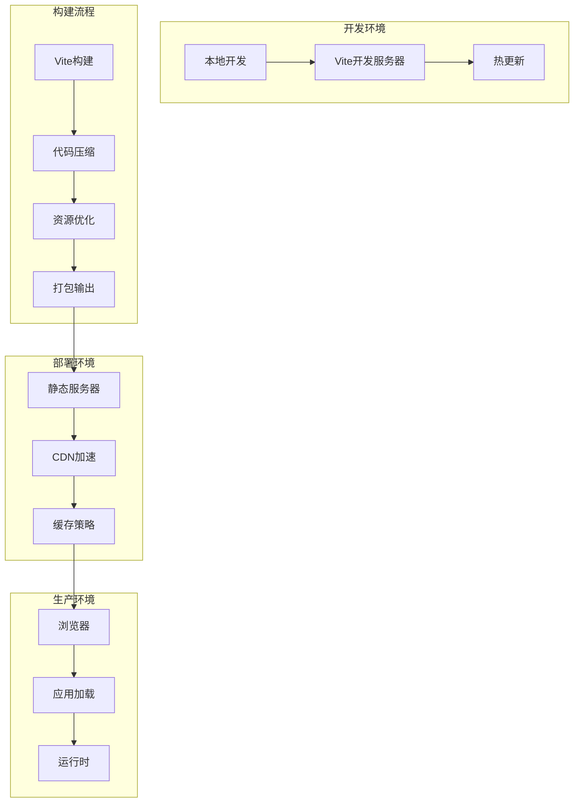
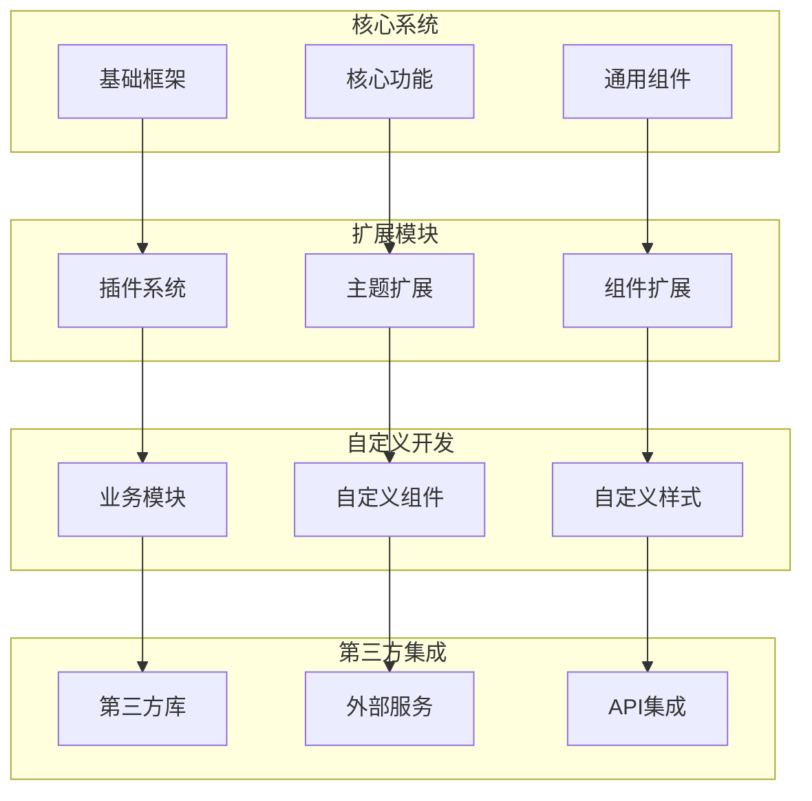

# Fantastic-admin 系统架构图

## 整体架构图

## 技术栈架构图

## 目录结构架构图

## 组件架构图

## 数据流架构图

## 路由架构图

## 权限架构图

## 主题架构图

## 部署架构图

## 扩展架构图

## 总结

Fantastic-admin 采用了分层架构设计，从前端应用到后端服务，各层职责明确，通过清晰的接口进行交互。系统基于 Vue 3 + TypeScript + Vite 的现代前端技术栈，实现了组件化、模块化的开发模式，具有良好的可维护性和扩展性。

架构图展示了系统的整体结构、技术栈、目录结构、组件关系、数据流向、路由系统、权限控制、主题管理、部署方式和扩展能力，为开发者提供了全面的系统视图，便于理解和维护。