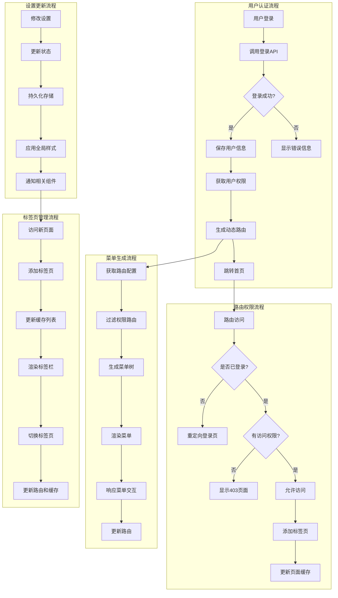
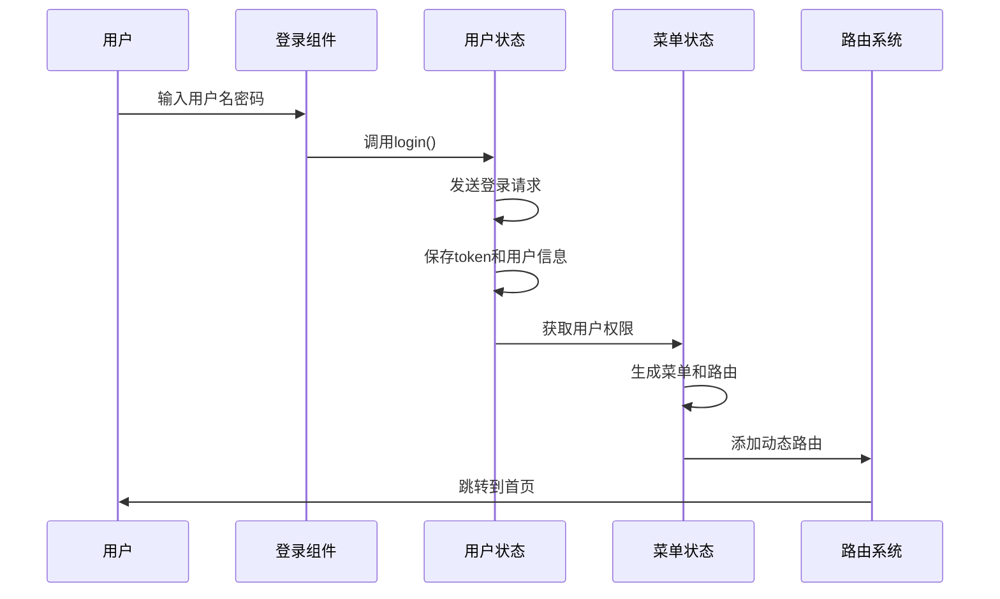
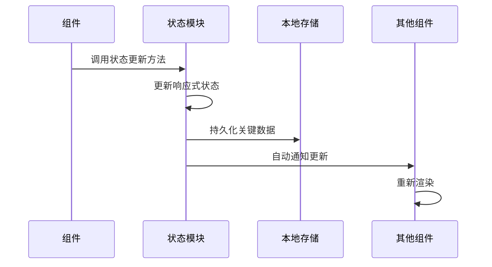

# 状态流转图

## 概述

Fantastic-admin 采用了 Pinia 作为状态管理库，实现了模块化的状态管理架构。系统将状态划分为多个独立的模块，每个模块负责管理特定领域的状态，通过响应式机制实现状态的自动更新和组件间的数据共享。

## 状态管理架构

### 核心模块

系统包含以下核心状态管理模块：

1. **用户状态模块 (user.ts)** - 管理用户认证、权限和用户信息
2. **菜单状态模块 (menu.ts)** - 管理导航菜单和路由权限
3. **路由状态模块 (route.ts)** - 管理动态路由和路由记录
4. **设置状态模块 (settings.ts)** - 管理系统配置和主题设置
5. **标签栏状态模块 (tabbar.ts)** - 管理多标签页和页面缓存
6. **页面缓存模块 (keepAlive.ts)** - 管理组件缓存状态

### 状态流转图



## 详细状态流转

### 1. 用户认证状态流转



### 2. 路由权限验证流程

```mermaid
sequenceDiagram
    participant User as 用户
    participant Router as 路由系统
    participant Guards as 路由守卫
    permission UserStore as 用户状态
    participant MenuStore as 菜单状态
    
    User->>Router: 访问路由
    Router->>Guards: 触发beforeEach
    Guards->>UserStore: 检查登录状态
    alt 未登录
        Guards->>Router: 重定向到登录页
    else 已登录
        Guards->>MenuStore: 检查路由权限
        alt 无权限
            Guards->>Router: 显示403页面
        else 有权限
            Guards->>Router: 允许访问
            Guards->>TabbarStore: 添加标签页
            Guards->>KeepAliveStore: 更新缓存
        end
    end
```

### 3. 菜单与路由联动流程

```mermaid
sequenceDiagram
    participant User as 用户
    participant Menu as 菜单组件
    participant MenuStore as 菜单状态
    participant Router as 路由系统
    permission RouteStore as 路由状态
    
    User->>Menu: 点击菜单项
    Menu->>MenuStore: 获取菜单数据
    MenuStore->>RouteStore: 查找对应路由
    RouteStore->>Router: 执行路由跳转
    Router->>MenuStore: 更新活动菜单
    MenuStore->>Menu: 高亮当前菜单项
```

### 4. 状态更新与响应流程



## 状态模块详细说明

### 用户状态模块 (user.ts)

负责管理用户认证相关的状态和操作：

- **状态**: account, token, accessToken, refreshToken, permissions, info
- **操作**: login(), logout(), getPermissions(), refreshAccessToken(), isLogin()
- **流转**: 登录 → 保存token → 获取权限 → 生成路由 → 注销 → 清除状态

### 菜单状态模块 (menu.ts)

负责管理导航菜单和权限过滤：

- **状态**: actived, allMenus, headerMenus, asideMenus, sidebarMenus
- **操作**: generateMenus(), filterAsyncRoutes(), getBreadcrumb()
- **流转**: 获取路由配置 → 权限过滤 → 生成菜单树 → 渲染菜单

### 路由状态模块 (route.ts)

负责管理动态路由和路由记录：

- **状态**: routeAdded, home, homeKey
- **操作**: generateRoutes(), flatMultiLevelRoutes(), init()
- **流转**: 初始化 → 生成路由 → 添加到路由系统 → 记录路由状态

### 设置状态模块 (settings.ts)

负责管理系统配置和主题设置：

- **状态**: settings, currentColorScheme, os, isReloading, title, mode
- **操作**: setColorScheme(), updateSettings(), toggleSidebarCollapse()
- **流转**: 修改设置 → 更新状态 → 应用样式 → 持久化

### 标签栏状态模块 (tabbar.ts)

负责管理多标签页和页面切换：

- **状态**: list, leaveIndex
- **操作**: add(), remove(), removeOtherSide(), removeLeftSide(), removeRightSide()
- **流转**: 访问页面 → 添加标签 → 切换标签 → 更新缓存

### 页面缓存模块 (keepAlive.ts)

负责管理组件缓存状态：

- **状态**: list
- **操作**: add(), remove(), clean()
- **流转**: 添加组件 → 更新缓存列表 → 组件缓存 → 移除组件 → 清除缓存

## 状态持久化

系统使用 `pinia-plugin-persistedstate` 实现状态持久化，确保关键状态在页面刷新后仍然保留：

- **用户状态**: token, 用户信息, 权限数据
- **设置状态**: 主题配置, 布局设置, 用户偏好
- **菜单状态**: 菜单配置, 权限路由

## 最佳实践

1. **模块化设计**: 每个状态模块职责单一，降低耦合度
2. **响应式更新**: 利用 Vue 3 的响应式系统，实现状态自动更新
3. **权限控制**: 通过状态管理实现细粒度的权限控制
4. **性能优化**: 合理使用页面缓存，避免不必要的组件重新渲染
5. **数据一致性**: 通过状态管理确保各组件间的数据一致性

## 总结

Fantastic-admin 的状态管理架构通过模块化设计和响应式机制，实现了高效的状态流转和数据共享。各状态模块职责明确，通过清晰的状态流转图和交互流程，确保了系统的可维护性和扩展性。这种设计使得开发者能够轻松理解和修改系统行为，同时保证了良好的用户体验。