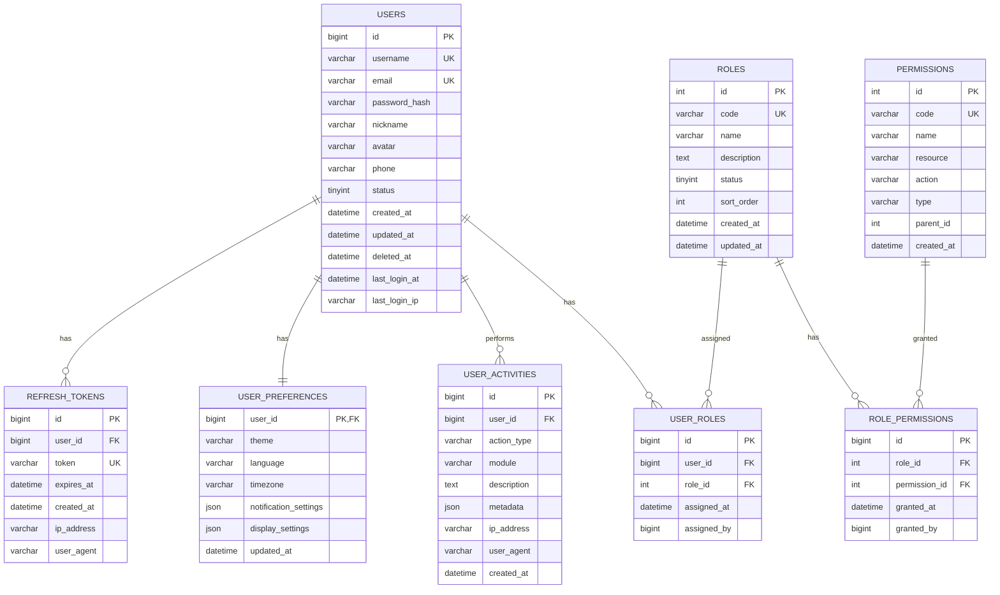
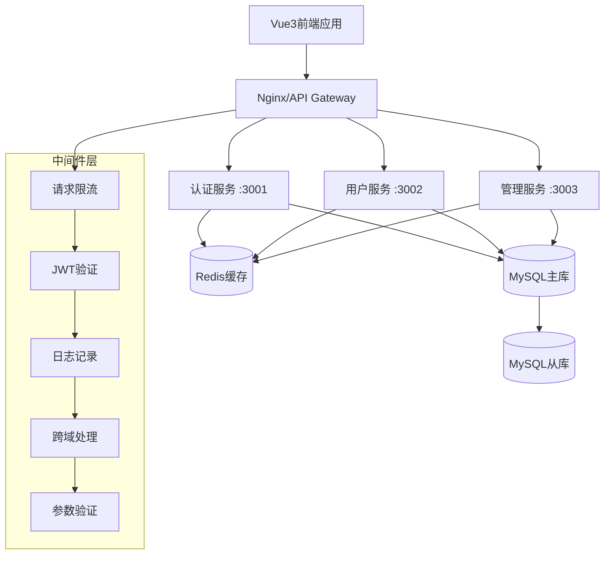

# Vue3管理系统 - 技术架构评估报告

## 📋 执行摘要

本报告针对当前Vue3管理系统进行全面技术架构评估,识别优势、问题和改进机会,并提供可执行的优化路线图。

---

## 🎯 技术栈概览

### 核心技术
- **前端框架**: Vue 3.5.13 + TypeScript 5.6.3
- **构建工具**: Vite 6.0.1
- **UI框架**: Element Plus
- **状态管理**: Pinia
- **路由**: Vue Router
- **HTTP客户端**: Axios

### 工程化工具
- ESLint (@antfu/eslint-config)
- UnoCSS (原子化CSS)
- VueUse (组合式工具集)
- Dayjs (日期处理)

---

## ✅ 架构优势

### 1. 现代化技术选型
- 使用最新的Vue 3 Composition API
- 完整的TypeScript类型系统
- Vite构建工具提供极速的开发体验

### 2. 优秀的代码组织
```
src/domains/
├── auth/          # 认证域
├── user/          # 用户域
└── infrastructure/ # 基础设施域
```
采用领域驱动设计(DDD)思想,按业务功能划分代码结构,便于维护和扩展。

### 3. 完善的主题系统
```typescript
// 支持功能
- 暗黑/明亮/自动主题切换
- 多种颜色方案(default/blue/green/purple/orange/red)
- 自定义主色调
- 响应式布局(mobile/tablet/desktop)
- 无障碍访问(高对比度、减少动画)
- 侧边栏折叠、紧凑模式
```

### 4. 移动端适配
```typescript
const BREAKPOINTS = {
  mobile: 768,
  tablet: 1024,
  desktop: 1200,
}
```
完整的断点系统,自动处理设备类型检测和屏幕方向变化。

---

## ⚠️ 发现的问题

### 🔴 高优先级问题

#### 1. Token存储策略不一致
**问题描述:**
```typescript
// 多处使用不同的key
localStorage.getItem('token')              // authStore.ts
localStorage.getItem('super-admin-token')  // httpClient
localStorage.getItem('refreshToken')       // authStore.ts
```

**影响**: 认证系统混乱,可能导致token丢失或获取错误

**解决方案:**
```typescript
// 创建统一的Token管理器
class TokenManager {
  private static readonly TOKEN_KEY = 'auth_token'
  private static readonly REFRESH_TOKEN_KEY = 'refresh_token'
  
  static setToken(token: string, refreshToken?: string) {
    localStorage.setItem(this.TOKEN_KEY, token)
    if (refreshToken) {
      localStorage.setItem(this.REFRESH_TOKEN_KEY, refreshToken)
    }
  }
  
  static getToken(): string | null {
    return localStorage.getItem(this.TOKEN_KEY)
  }
  
  static getRefreshToken(): string | null {
    return localStorage.getItem(this.REFRESH_TOKEN_KEY)
  }
  
  static clearAll() {
    localStorage.removeItem(this.TOKEN_KEY)
    localStorage.removeItem(this.REFRESH_TOKEN_KEY)
  }
}
```

#### 2. HTTP响应拦截器实现错误
**问题描述:**
```typescript
// 当前实现
httpClient.interceptors.response.use(
  (response: AxiosResponse<ApiResponse>) => {
    return response; // ❌ 返回整个response对象
  }
);
```

**影响**: 业务代码需要访问`response.data.data`,增加复杂度

**解决方案:**
```typescript
httpClient.interceptors.response.use(
  (response: AxiosResponse<ApiResponse>) => {
    const { data } = response;
    
    // 统一处理业务状态码
    if (data.code !== 200) {
      ElMessage.error(data.message || '请求失败');
      return Promise.reject(new Error(data.message));
    }
    
    return data.data; // ✅ 直接返回业务数据
  },
  (error: AxiosError) => {
    // 错误处理...
    return Promise.reject(error);
  }
);
```

#### 3. 缺少令牌自动刷新机制
**问题描述:** 
当access token过期时,直接跳转登录页,没有尝试使用refresh token刷新

**影响**: 用户体验差,需要频繁重新登录

**解决方案:**
```typescript
let isRefreshing = false;
let failedQueue: any[] = [];

const processQueue = (error: any, token: string | null = null) => {
  failedQueue.forEach(prom => {
    if (error) {
      prom.reject(error);
    } else {
      prom.resolve(token);
    }
  });
  failedQueue = [];
};

httpClient.interceptors.response.use(
  response => response,
  async (error: AxiosError) => {
    const originalRequest = error.config;
    
    if (error.response?.status === 401 && !originalRequest._retry) {
      if (isRefreshing) {
        // 正在刷新token,将请求加入队列
        return new Promise((resolve, reject) => {
          failedQueue.push({ resolve, reject });
        }).then(token => {
          originalRequest.headers['Authorization'] = 'Bearer ' + token;
          return httpClient(originalRequest);
        });
      }

      originalRequest._retry = true;
      isRefreshing = true;

      const refreshToken = TokenManager.getRefreshToken();
      if (!refreshToken) {
        router.push('/login');
        return Promise.reject(error);
      }

      try {
        const response = await authService.refreshToken(refreshToken);
        const newToken = response.token;
        
        TokenManager.setToken(newToken, response.refreshToken);
        processQueue(null, newToken);
        
        originalRequest.headers['Authorization'] = 'Bearer ' + newToken;
        return httpClient(originalRequest);
      } catch (refreshError) {
        processQueue(refreshError, null);
        TokenManager.clearAll();
        router.push('/login');
        return Promise.reject(refreshError);
      } finally {
        isRefreshing = false;
      }
    }
    
    return Promise.reject(error);
  }
);
```

### 🟡 中优先级问题

#### 4. Store设计风格不统一
**问题描述:**
- `authStore.ts`: 使用Options API风格
- `userStore.ts`: 使用Composition API风格

**建议:** 统一为Composition API风格,获得更好的类型推导和代码复用

#### 5. 未实现路由懒加载
**问题描述:** 所有路由组件都是同步导入,导致首屏加载时间长

**解决方案:**
```typescript
const routes = [
  {
    path: '/users',
    name: 'UserList',
    component: () => import('@/domains/user/views/UserList.vue'),
    meta: { requiresAuth: true }
  }
]
```

#### 6. 缺少全局错误处理
**问题描述:** 没有捕获Vue组件运行时错误

**解决方案:**
```typescript
// main.ts
app.config.errorHandler = (err, instance, info) => {
  console.error('全局错误:', err);
  logService.error('Vue运行时错误', {
    error: err,
    componentName: instance?.$options.name,
    info
  });
  
  ElMessage.error('系统错误,请稍后重试');
};

app.config.warnHandler = (msg, instance, trace) => {
  console.warn('Vue警告:', msg);
};
```

#### 7. 类型定义不完整
**问题描述:** HTTP响应类型缺少泛型支持

**解决方案:**
```typescript
interface ApiResponse<T = any> {
  code: number;
  message: string;
  data: T;
  timestamp?: number;
}

// 使用示例
const getUsers = (): Promise<User[]> => {
  return httpClient.get<ApiResponse<User[]>>('/api/users')
    .then(res => res.data);
};
```

### 🟢 低优先级问题

#### 8. 性能优化空间
- 缺少组件级代码分割
- 未实现虚拟滚动(大列表场景)
- 图片未懒加载
- 打包体积可进一步优化

#### 9. 缺少单元测试
- 无测试覆盖率
- 建议添加Vitest进行单元测试

---

## 📊 数据库设计方案

### ER图



### 核心表设计

#### 1. users - 用户表
```sql
CREATE TABLE users (
  id BIGINT PRIMARY KEY AUTO_INCREMENT,
  username VARCHAR(50) UNIQUE NOT NULL,
  email VARCHAR(100) UNIQUE NOT NULL,
  password_hash VARCHAR(255) NOT NULL,
  nickname VARCHAR(50),
  avatar VARCHAR(255),
  phone VARCHAR(20),
  status TINYINT DEFAULT 1 COMMENT '1:正常 0:禁用',
  created_at DATETIME DEFAULT CURRENT_TIMESTAMP,
  updated_at DATETIME DEFAULT CURRENT_TIMESTAMP ON UPDATE CURRENT_TIMESTAMP,
  deleted_at DATETIME NULL,
  last_login_at DATETIME,
  last_login_ip VARCHAR(45),
  INDEX idx_username (username),
  INDEX idx_email (email),
  INDEX idx_status (status)
) ENGINE=InnoDB DEFAULT CHARSET=utf8mb4 COLLATE=utf8mb4_unicode_ci;
```

#### 2. roles - 角色表
```sql
CREATE TABLE roles (
  id INT PRIMARY KEY AUTO_INCREMENT,
  code VARCHAR(50) UNIQUE NOT NULL,
  name VARCHAR(50) NOT NULL,
  description TEXT,
  status TINYINT DEFAULT 1,
  sort_order INT DEFAULT 0,
  created_at DATETIME DEFAULT CURRENT_TIMESTAMP,
  updated_at DATETIME DEFAULT CURRENT_TIMESTAMP ON UPDATE CURRENT_TIMESTAMP,
  INDEX idx_code (code),
  INDEX idx_status (status)
) ENGINE=InnoDB DEFAULT CHARSET=utf8mb4 COLLATE=utf8mb4_unicode_ci;
```

#### 3. permissions - 权限表
```sql
CREATE TABLE permissions (
  id INT PRIMARY KEY AUTO_INCREMENT,
  code VARCHAR(100) UNIQUE NOT NULL,
  name VARCHAR(50) NOT NULL,
  resource VARCHAR(100),
  action VARCHAR(50),
  type VARCHAR(20) COMMENT 'menu/button/api',
  parent_id INT DEFAULT 0,
  created_at DATETIME DEFAULT CURRENT_TIMESTAMP,
  INDEX idx_code (code),
  INDEX idx_type (type),
  INDEX idx_parent_id (parent_id)
) ENGINE=InnoDB DEFAULT CHARSET=utf8mb4 COLLATE=utf8mb4_unicode_ci;
```

#### 4. refresh_tokens - 刷新令牌表
```sql
CREATE TABLE refresh_tokens (
  id BIGINT PRIMARY KEY AUTO_INCREMENT,
  user_id BIGINT NOT NULL,
  token VARCHAR(500) UNIQUE NOT NULL,
  expires_at DATETIME NOT NULL,
  created_at DATETIME DEFAULT CURRENT_TIMESTAMP,
  ip_address VARCHAR(45),
  user_agent VARCHAR(255),
  FOREIGN KEY (user_id) REFERENCES users(id) ON DELETE CASCADE,
  INDEX idx_user_id (user_id),
  INDEX idx_token (token),
  INDEX idx_expires_at (expires_at)
) ENGINE=InnoDB DEFAULT CHARSET=utf8mb4 COLLATE=utf8mb4_unicode_ci;
```

---

## 🏗️ 后端API架构建议

### 系统架构图



### API端点设计

#### 认证相关
```
POST   /api/auth/login           # 用户登录
POST   /api/auth/logout          # 用户登出
POST   /api/auth/refresh         # 刷新令牌
POST   /api/auth/register        # 用户注册
POST   /api/auth/forgot-password # 忘记密码
POST   /api/auth/reset-password  # 重置密码
GET    /api/auth/verify-email    # 邮箱验证
```

#### 用户相关
```
GET    /api/users/profile        # 获取当前用户信息
PUT    /api/users/profile        # 更新用户信息
POST   /api/users/avatar         # 上传头像
GET    /api/users/preferences    # 获取用户偏好
PUT    /api/users/preferences    # 更新用户偏好
GET    /api/users/activities     # 获取活动记录
GET    /api/users/stats          # 获取统计信息
POST   /api/users/change-password # 修改密码
DELETE /api/users/account        # 删除账户
```

#### 管理员相关
```
GET    /api/admin/users          # 用户列表
GET    /api/admin/users/:id      # 用户详情
POST   /api/admin/users          # 创建用户
PUT    /api/admin/users/:id      # 更新用户
DELETE /api/admin/users/:id      # 删除用户
POST   /api/admin/users/:id/ban  # 封禁用户

GET    /api/admin/roles          # 角色列表
POST   /api/admin/roles          # 创建角色
PUT    /api/admin/roles/:id      # 更新角色
DELETE /api/admin/roles/:id      # 删除角色

GET    /api/admin/permissions    # 权限列表
```

### 响应格式规范

```typescript
// 成功响应
{
  "code": 200,
  "message": "success",
  "data": { /* 业务数据 */ },
  "timestamp": 1698765432000
}

// 错误响应
{
  "code": 400,
  "message": "参数错误",
  "errors": [
    { "field": "username", "message": "用户名不能为空" }
  ],
  "timestamp": 1698765432000
}

// 分页响应
{
  "code": 200,
  "message": "success",
  "data": {
    "items": [ /* 数据列表 */ ],
    "total": 100,
    "page": 1,
    "pageSize": 20,
    "totalPages": 5
  },
  "timestamp": 1698765432000
}
```

---

## 🚀 优化实施路线图

### 阶段一: 紧急修复 (1-2天)

#### 任务清单
- [ ] 创建统一的TokenManager工具类
- [ ] 重构authStore和httpClient使用统一的token管理
- [ ] 修复HTTP响应拦截器返回值问题
- [ ] 添加类型定义文件改进
- [ ] 更新相关单元测试(如果有)

#### 验收标准
- [ ] 所有token操作使用TokenManager
- [ ] HTTP拦截器返回正确的数据结构
- [ ] TypeScript编译无错误
- [ ] 登录/登出功能正常

---

### 阶段二: 架构优化 (3-5天)

#### 任务清单
- [ ] 实现令牌自动刷新机制
  - [ ] 添加刷新token的请求队列
  - [ ] 实现401拦截器逻辑
  - [ ] 添加token过期时间管理
- [ ] 实现路由懒加载
  - [ ] 改造路由配置为动态导入
  - [ ] 添加路由加载进度条
- [ ] 添加全局错误处理
  - [ ] Vue错误捕获
  - [ ] Promise rejection处理
  - [ ] 错误上报机制
- [ ] 统一Store风格为Composition API
  - [ ] 重构authStore
  - [ ] 优化类型定义

#### 验收标准
- [ ] Token过期自动刷新,无需重新登录
- [ ] 路由按需加载,首屏体积减少
- [ ] 错误统一处理和上报
- [ ] Store代码风格一致

---

### 阶段三: 性能优化 (3-5天)

#### 任务清单
- [ ] 组件级代码分割
  - [ ] 识别大型组件进行拆分
  - [ ] 使用defineAsyncComponent
- [ ] 实现虚拟滚动(大列表场景)
  - [ ] 集成vue-virtual-scroller
  - [ ] 改造用户列表等大数据组件
- [ ] 图片懒加载
  - [ ] 使用VueUse的useIntersectionObserver
  - [ ] 添加占位图
- [ ] 打包优化
  - [ ] 分析打包体积
  - [ ] 配置Chunk分割策略
  - [ ] 压缩和Tree Shaking优化
  - [ ] 启用Gzip/Brotli压缩

#### 验收标准
- [ ] 首屏加载时间 < 3秒
- [ ] 打包体积减少30%以上
- [ ] Lighthouse性能分数 > 90
- [ ] 大列表滚动流畅(60fps)

---

### 阶段四: 后端开发 (1-2周)

#### 任务清单
- [ ] 数据库设计与迁移
  - [ ] 创建数据库schema
  - [ ] 编写初始化脚本
  - [ ] 准备种子数据
- [ ] 认证系统开发
  - [ ] JWT生成与验证
  - [ ] 刷新令牌机制
  - [ ] 密码加密存储
- [ ] 用户管理API
  - [ ] CRUD接口
  - [ ] 头像上传
  - [ ] 偏好设置
- [ ] 权限系统
  - [ ] RBAC实现
  - [ ] 权限验证中间件
- [ ] API文档
  - [ ] Swagger/OpenAPI文档
  - [ ] 接口测试

#### 验收标准
- [ ] 所有API接口正常工作
- [ ] 接口响应时间 < 200ms
- [ ] 安全性测试通过
- [ ] API文档完整

---

## 📈 技术风险评估

| 风险项 | 严重程度 | 可能性 | 影响范围 | 缓解措施 |
|--------|---------|--------|---------|---------|
| Token存储不一致导致认证失败 | 🔴 高 | 高 | 登录/认证 | 立即统一Token管理 |
| 缺少令牌刷新导致频繁登录 | 🔴 高 | 高 | 用户体验 | 实现自动刷新机制 |
| HTTP响应格式不统一 | 🟡 中 | 中 | 数据处理 | 规范响应拦截器 |
| Store设计不统一 | 🟡 中 | 低 | 代码维护 | 逐步重构为统一风格 |
| 性能问题(首屏慢) | 🟡 中 | 中 | 用户体验 | 实施性能优化方案 |
| 缺少单元测试 | 🟢 低 | 高 | 代码质量 | 补充关键路径测试 |
| 打包体积过大 | 🟢 低 | 中 | 加载速度 | 优化打包配置 |

---

## 🎯 关键指标目标

### 性能指标
- **首屏加载时间**: < 3秒 (目前约5-6秒)
- **路由切换时间**: < 300ms
- **API响应时间**: < 200ms
- **打包体积**: < 500KB (gzip后)
- **Lighthouse分数**: > 90

### 质量指标
- **TypeScript覆盖率**: 100%
- **单元测试覆盖率**: > 80%
- **代码重复率**: < 5%
- **安全漏洞**: 0个高危

### 用户体验指标
- **登录成功率**: > 99%
- **Token刷新成功率**: > 95%
- **页面错误率**: < 0.1%

---

## 💡 最佳实践建议

### 1. 代码规范
```typescript
// ✅ 推荐: 使用Composition API
export const useAuthStore = defineStore('auth', () => {
  const token = ref<string | null>(null);
  const user = ref<User | null>(null);
  
  const login = async (credentials: LoginCredentials) => {
    // ...
  };
  
  return { token, user, login };
});

// ❌ 避免: Options API(除非有特殊理由)
export const useAuthStore = defineStore('auth', {
  state: () => ({ token: null }),
  actions: { login() {} }
});
```

### 2. 错误处理
```typescript
// ✅ 推荐: 统一错误处理
try {
  await authService.login(credentials);
} catch (error) {
  if (error instanceof AuthError) {
    ElMessage.error(error.message);
  } else {
    logService.error('未知错误', error);
    ElMessage.error('系统错误,请稍后重试');
  }
}

// ❌ 避免: 简单的console.error
try {
  await authService.login(credentials);
} catch (error) {
  console.error(error); // 不够健壮
}
```

### 3. 类型安全
```typescript
// ✅ 推荐: 明确的类型定义
interface LoginResponse {
  token: string;
  refreshToken: string;
  user: User;
  expiresIn: number;
}

const login = (credentials: LoginCredentials): Promise<LoginResponse> => {
  return httpClient.post('/api/auth/login', credentials);
};

// ❌ 避免: 使用any
const login = (credentials: any): Promise<any> => { ... }
```

### 4. 性能优化
```typescript
// ✅ 推荐: 懒加载
const UserList = () => import('@/domains/user/views/UserList.vue');

// ❌ 避免: 同步导入大组件
import UserList from '@/domains/user/views/UserList.vue';
```

---

## 📚 参考资料

- [Vue 3 官方文档](https://vuejs.org/)
- [TypeScript 官方文档](https://www.typescriptlang.org/)
- [Vite 官方文档](https://vitejs.dev/)
- [Element Plus 文档](https://element-plus.org/)
- [Pinia 文档](https://pinia.vuejs.org/)
- [JWT 最佳实践](https://tools.ietf.org/html/rfc8725)
- [OWASP 安全指南](https://owasp.org/www-project-top-ten/)

---

## 📞 联系方式

如有任何问题或建议,请通过以下方式联系:

- 项目仓库: [GitHub](https://github.com/your-repo)
- 技术文档: [Wiki](https://github.com/your-repo/wiki)
- 问题反馈: [Issues](https://github.com/your-repo/issues)

---

**报告生成时间**: 2025-10-25  
**版本**: v1.0  
**状态**: 待审核